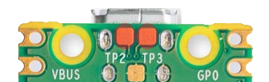

# USB Serial Mouse Adapter
A USB to serial mouse adapter!


## About
This project came about when I got my hands on an old 486 based PC. Having never really dipped my toes into retro computing, I didn't have an old serial mouse on hand. A quick eBay searched revealed that the decent ones cost a nice chunk of change that I didn't feel they were worth. Another search on Vogons revealed that some mad lads out there made active PS/2 to serial adapters using various micro controllers.  
Out of curiosity I examined how these worked and thought "Why can't I do this with a Pi Pico and USB mouse?" which kicked off this project. 

I hope it sparks your interest!
-Lime

## Features
With this adapter you can convert a modern native USB mouse to a classic serial mouse. That's right, native USB! No cheating by secretly using PS/2 compatible mice.
Want to use an optical mouse on a 386 running Wolfenstein 3D? Well now you can! Want to use a wireless optical mouse on a 486 running Doom? Well you might be able to! (depending on the mouse)

**Supported Protocols:**
- Microsoft Two Button
- Logitech Three Button
- Microsoft Wheel

**Unsupported Protocols: (May change based on demand)**
- Mousesystems
- Sun
- MM

### KVM:
Support for use on KVMs has been added as of version 1.1.1. 
It works fine on my **one**, startech branded, KVM that I have test with. Given that TinyUSB is a bit picky, your results may vary.

## PCBs
There are two variants of the PCB available in the KiCad folder, Phat and Slim for your preference. The main circuit for both PCBs is the same so the firmware package will work on both PCBs. A full BOM for LCSC (except for header pins) is available in the Phat folder: [LCSC BOM](https://raw.githubusercontent.com/LimeProgramming/USB-serial-mouse-adapter/main/KiCad/Phat/BOM_LCSC.xls). For the Slim build you can omit the dip switches and reset switch (you will have to source an appropriate SMD reset switch).

### Building a PCB:

#### MAX232/3232 voltage selection:
The PCB has a jumper to select between 3.3v and 5v for the MAX chip. 
- If you're using a MAX232 then bridge 5v to the center pin and install all the resistors. The part listed in the [BOM](https://raw.githubusercontent.com/LimeProgramming/USB-serial-mouse-adapter/main/KiCad/Phat/BOM_LCSC.xls) is a MAX232 chip.
- If you're using a MAX3232 then bridge 3.3v to the center pin, bridge R4 and R3, and remove R1 and R2.

#### Board to Pico USB data connection:
The `TP2` and `TP3` testpoints on the board must be soldered to the corresponding `TP2` and `TP3` test points on the Pico, underneath the USB connector:

[](images/Pico_bottom.png)


### Phat:
[](https://raw.githubusercontent.com/LimeProgramming/USB-serial-mouse-adapter/main/images/phat_readme.png)

Also known as the original design.
This PCB is the version I had made with the mindset of it being the default/one and only. 
| Differences | Silkscreen | Description |
|:--:|:--:| :--:|
| Serial Pin Header | J1 | Intended to use with a serial breakout cable |
| USB Pin Header | J3 | Intended to be used with motherboard USB breakout cables |
| Dip Switches | SW1 | Quickly and easily configure the adapter |

#### Phat Cases:
[](https://raw.githubusercontent.com/LimeProgramming/USB-serial-mouse-adapter/main/images/external_reander.png)[](https://raw.githubusercontent.com/LimeProgramming/USB-serial-mouse-adapter/main/images/Internal_render.png)

### Slim:
[](https://raw.githubusercontent.com/LimeProgramming/USB-serial-mouse-adapter/main/images/slim_readme.png)

Made for people be require the adapter to be as small as possible. Not much wider than the serial port itself. 

## Powering the device
### MicroUSB:
[](https://raw.githubusercontent.com/LimeProgramming/USB-serial-mouse-adapter/main/images/power_microusb.png)
The easiest way to power the device would be to use the Pico's micro USB port. Be sure to use a USB power only cable or a wall power adapter otherwise it won't pick up the mouse.

**PLEASE NOTE:** Some "power only" USB cables have the data lines shorted together. You can test if this is the case by plugging the cable into the Pico and using a meter to check for continuity between `TP2` and `TP3` on the Pico. If there is continuity you have a cable like this. Cut the data lines on a normal USB cable as an option.
<br clear="left"/>

### Power-In Header:
[](https://raw.githubusercontent.com/LimeProgramming/USB-serial-mouse-adapter/main/images/power_header.png)
Both the Phat and Slim PCB's feature an 5 volt power in header. You can use this creatively to power the adapter, even from the PC itself perhaps? Personally I'm connecting it to a wall power supply to give a more secure connection than MicroUSB.
<br clear="left"/>

### Other ways:
There is nothing stopping you from powering the device using a powered OTG cable or a hacked up USB extension lead. The device itself needs about 100 milliamps so as long as you get it that power, it'll run away happily!

## Configuration

The adapter has quite a few settings available and these settings are stored on micro controllers flash memory. 
It will remember your settings between uses and the same settings carry between different computers and even firmware upgrades (unless otherwise state in a changes log)

There are two primary ways of editing the settings of the USB-2-232

### Headers
The phat variant of the PCB includes headers in either of the form of dip switches or jumper headers. While not super configurable they do give quick access to some handy settings. The headers can be set while the micro controller is on with changes being applied in real-time or they can be set while the micro controller is off with changes being applied next time the controller is booted.

| Num | Setting |
|:--:|:--:|
| 1 | Three Button Logitech Protocol |
| 2 | MS Wheel Protocol |
| 3 | 75% Mouse Travel Modifier / Dip 3 + 4 for 25% |
| 4 | 50% Mouse Travel Modifier / Dip 3 + 4 for 25% |
| 5 | 7N2|
| 6 | 19200 Baud Rate|

### Serial Terminal


Both the phat and slim variants of the PCB support being configured via serial terminal. The serial terminal allows for more advanced configuration of the mouse adapter. Any additional settings added in a software update will be available here.
The serial terminal has been translated to German, images available in both German and English as default langauge.  

### Serial Terminal Options
+ Mouse Travel
    + List Config
            | List the current mouse travel settings
    + XY Travel 
            | XY mouse travel modifier 1% -> 200%
    + X Travel
             | X (Left and Right) mouse travel modifier 1% -> 200%
    + Y Travel 
            | Y ( Up and Down) mouse travel modifier 1% -> 200%
    + Invert X
            | Invert X (Left and Right) mouse movement.
    + Invert Y
            | Invert Y (Up and Down) mouse movement.
    + Movement Type
            | Set Movement Type. USB mice talk faster than serial mice, movement type decides what to do with the backlog between serial mouse updates.
        + Additive: 
                | Sum the mouse movement (Sensitive)
        + Average
                | Avg the mouse movement  (Insensitive)
        + Coast 
                | Send the mouse movement incrementally (Slippy)
    + Cosine Smoothing
            | Makes the cursor proportionally less sensitive at high speeds, leaving the movement mostly one to one at low speeds

+ Mouse Buttons
    + List Config
        | List the current mouse button settings
    + Swap Left and Right
        | Swap the left and right mouse buttons
    + Use Forward and Backward
        | Use the mouse forward and back buttons as alternative left and right buttons
    + Swap Forward and Backward
        | Swap forward and back buttons if they are being used as alternative left and right buttons
+ Serial Settings
    + List Config
        | List the current serial settings
    + Format
        | One stop bit (7N1) or two stop bits (7N2) 
    + Baud Rate
        | 1200 2400 4800 9600 19200 Baud Rates. Note you will need compatible mouse drivers.
     + Mouse Type
     | Microsoft 2 Button, Logitech Three Button or Microsoft Wheel mouse. Note: You may need to reconfigure your mouse driver upon change.
+ Firmware
    + Information | Information about the firmware
    + Language | Set the language of the settings terminal
    + Reset | Reset mouse settings back to default
    + List Default Settings | List the default settings of the adapter
+ Exit
    + Return to mouse mode

### Accessing the terminal
You can access the serial terminal in one of two ways:

#### Method 1: Serial Terminal Emulator
You can open a serial terminal emulator (like kermit) on the computer you have the mouse connected to, connect to the same com port the mouse driver is using and press the enter key.
```
Baud Rate: User Set
Data Bits: 7
Stop Bits: User Set
Parity: None
Flow Control: None
```
#### Method 2: USB to TTL
You can also connect the unused UART of the Pi Pico with a cheap USB to TTL device or even another Pico running the picoprobe firmware. Open your favorite serial terminal emulator (like putty) connect to the TTL device and tap the enter key. 
```
Baud Rate: 115200
Data Bits: 8
Stop Bits: 1
Parity: None
Flow Control: None
```
Connecting to the adapter in this way will allow you to change settings regardless of the adapter being connected to a PC or not. 
The unused UART of the pico can be accessed from the top two pins between the full size USB port of the PCB and the micro USB port of the Pico.

### Resetting the adapter
Forgot your settings and can't get the adapter working? Don't worry.
There are three different ways to reset the adapter:

#### --- Serial Terminal
As written above, you can reset the adapter back to default settings from the terminal. You can connect to the unused UART of the pico regardless of the settings of the mouse. 

#### --- Small Flat Head Screwdriver
[](https://raw.githubusercontent.com/LimeProgramming/USB-serial-mouse-adapter/main/images/reset_flash.jpg)

**How To:**
1. Press a small flat head into the position shown above.
2. Power on the adapter and the Picos built-in LED will glow solid.
3. Hold the flat head in position for two or three seconds for the Picos LED to start blinking.
4. Once it is blinking, you can let go of the GPIO and press the reset button.
5. The adapter will boot up with default settings.
#### --- Nuke UF2
**How To:**
1. Download the [flash_nuke.uf2](https://datasheets.raspberrypi.com/soft/flash_nuke.uf2) file.
2. Connect the adapter to your PC using the microusb port built into the Pi Pico.
3. Hold Reset, then bootsel, then release reset then bootsel. This will make the Pico appear as a removable storage device. 
4. Drag the flash_nuke.uf2 file to the storage device. This will reset the flash the on the Pi Pico.
5. The Pico should reboot on its own and show up as a removable storage device again. If it doesn't, tap the reset button.
6. Download the latest firmware and drag that UF2 file to the storage device.
7. The adapter will boot up with default settings.

# Compiling the Firmware
The default mouse settings can be edited in `default_config.h` prior to compilation. You can use this to set the mouses default settings for your own configuration. 

The build environment is a normal PicoSDK setup, there are several guides out the for both Linux and Windows.  From experience the setup is easier in Linux. However there is one important thing you need to know:

**PicoSDK version 1.3.0**
The version of TinyUSB used in this project was customized. The customized version of TinyUSB can be found in the firmware folder. If you want to compile the firmware yourself you will need to replace the stock TinyUSB with the customized version found here

